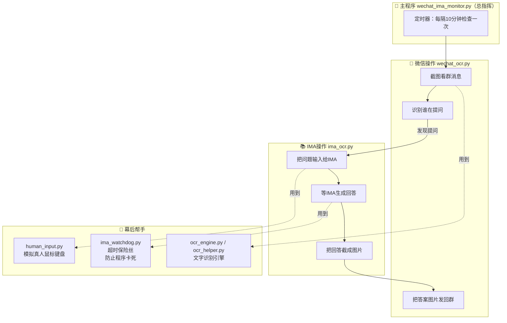
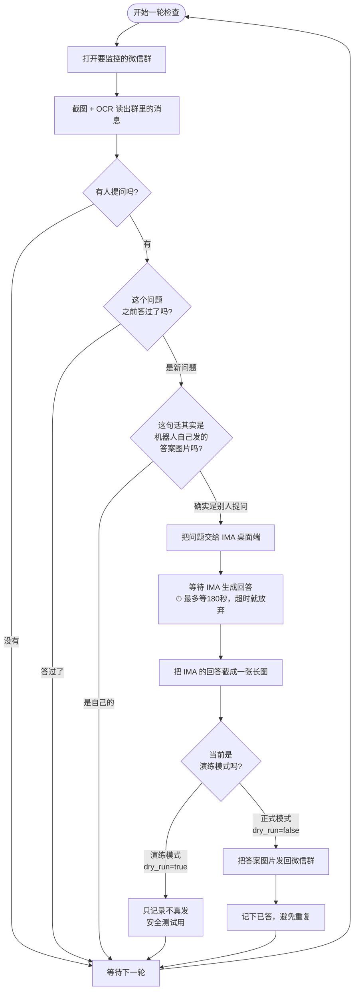

# 项目总览：微信 → IMA 知识库 自动答疑机器人

> 这份文档写给**完全不懂编程**的人看。读完你就能明白：这个程序是干嘛的、
> 它是怎么一步步工作的、每个文件负责什么。遇到不懂的词，翻到最后的「术语表」。

---

## 一、这个程序到底是做什么的？（一句话版）

> **它像一个不知疲倦的「志愿者」：盯着你指定的微信群，一旦有人提问，
> 就自动去「IMA 知识库」里查答案，再把答案发回群里。**

打个比方：
- 你开了一个「佛学问答群」，群里常有人问「什么是四圣谛？」这类问题。
- 你手头有一个整理好的资料库（叫 **IMA 知识库**，里面是「古源尊者开示及上座部佛教资料」）。
- 以前你得自己盯着群、自己去查、自己回答，很累。
- 现在这个程序替你干这件事：**自动盯群 → 自动查 → 自动回答**。

---

## 二、它是怎么「看懂」微信和 IMA 的？（关键难点）

普通程序想操作微信，一般会调用微信提供的「官方接口」。但有两个麻烦：

1. **微信 4.0 版把聊天内容「藏」起来了**，程序读不到文字。
2. **用官方接口做自动化，容易被判定为「外挂」而封号**。

所以这个程序换了一个「更像真人」的笨办法，分三步：

| 步骤 | 做法 | 好比人在做什么 |
|---|---|---|
| **看** | 对屏幕**截图**，再用 **OCR（文字识别）** 把图片里的字读出来 | 用眼睛看屏幕 |
| **想** | 判断这句话是不是「提问」，去知识库查答案 | 用脑子理解 |
| **做** | 用**模拟鼠标移动+点击、模拟键盘打字**去操作 | 用手点鼠标、敲键盘 |

> 关键点：所有操作都**模拟真人**——鼠标移动带轨迹和轻微抖动、打字有随机停顿，
> 尽量不被微信的「反外挂系统」发现。

---

## 三、整体结构图（各部分怎么配合）

---

## 四、完整工作流程（一轮从头到尾发生了什么）

> **重点安全设计**：
> - **演练模式（dry_run=true）**：程序会走完整个流程，但**不真的发消息**，只记录「本来会回答什么」。
>   先用这个模式确认读群、找答案都准确，再切成正式模式。
> - **超时保险丝**：等 IMA 回答时，最多等 180 秒。万一 IMA 卡住，到点会强制放弃，
>   **绝不让整个程序永久卡死**（这是之前反复出问题、后来专门修好的地方）。
> - **防重复**：同一个问题只答一次；还能识别「自己发的答案图片被误读成新问题」的情况，避免鬼打墙。

---

## 五、文件清单（每个文件负责什么）

### 核心文件（程序运行必须用到）

| 文件名 | 通俗职责 | 大约行数 |
|---|---|---|
| `wechat_ima_monitor.py` | **总指挥**：定时循环、判断提问、串联整个流程 | 541 |
| `wechat_ocr.py` | **微信操作员**：截图读群消息、把答案图片发回群 | 782 |
| `ima_ocr.py` | **IMA 操作员**：把问题喂给 IMA、等回答、截图 | 907 |
| `human_input.py` | **手和眼**：模拟真人的鼠标移动、点击、打字 | 103 |
| `ima_watchdog.py` | **保险丝**：给操作设超时上限，防止永久卡死 | 50 |
| `ocr_engine.py` | **识字引擎**：调用文字识别能力 | 40 |
| `ocr_helper.py` | **识字助手**：识别结果的辅助处理 | 29 |
| `answer_card.py` | **答案排版**：把答案整理成好看的图片卡片 | 141 |

### 辅助/可视化文件（帮助理解和调试，不影响主功能）

| 文件名 | 通俗职责 |
|---|---|
| `flow_def.py` | 定义「程序有哪些步骤」 |
| `flow_runtime.py` | 运行时记录「现在走到哪一步了」 |
| `flow_visualizer.py` | 把运行过程画成流程图 |
| `menu.py` | 命令行菜单 |
| `config.json` | **配置文件**：填你的群名、知识库信息、各种开关 |

### 其它文件（可忽略）

- `diag_*.py`、`test_*.py`：开发时的**诊断脚本和测试脚本**，正式使用不需要管。
- `*.log`、`*.png`、`*.json`（状态文件）：程序运行时产生的**日志、截图、临时记录**。

---

## 六、怎么运行它？（命令速查）

> 在项目文件夹里打开命令行，输入下面的命令（`python` 换成你的实际 python 路径）。

| 命令 | 作用 |
|---|---|
| `python wechat_ima_monitor.py` | 持续运行，每 10 分钟检查一轮 |
| `python wechat_ima_monitor.py --once` | 只检查一轮就停 |
| `python wechat_ima_monitor.py --auto` | 全自动：先自检，通过后自动循环 |
| `python wechat_ima_monitor.py --live` | 正式模式，**真的发消息**（先用演练模式验证过再用） |
| `python wechat_ima_monitor.py --list-groups` | 列出当前能看到的群名，方便填配置 |
| `python wechat_ima_monitor.py --ask-ima "什么是四圣谛"` | 只测试一次「让 IMA 回答问题」 |

---

## 七、术语表（不懂的词看这里）

| 术语 | 大白话解释 |
|---|---|
| **OCR** | Optical Character Recognition，「光学字符识别」。就是**把图片里的文字认出来**变成可用的文字，好比人用眼睛看图认字。 |
| **IMA** | 腾讯的一个知识库/AI 问答工具。这里指桌面版 IMA，里面存着佛学资料。 |
| **知识库（kb）** | 一堆整理好的资料的集合。程序去里面查答案。 |
| **dry_run（演练模式）** | 「空跑」。程序走完所有流程但**不真的发消息**，用来安全测试。 |
| **截图 / 截屏** | 把屏幕当前画面拍成一张图片。 |
| **拟人化 / 模拟真人** | 让鼠标键盘操作看起来像真人在操作（有轨迹、有抖动、有停顿），不像机器。 |
| **超时（timeout）** | 「最多等多久」。等超过这个时间就放弃，防止一直干等。 |
| **watchdog（看门狗）** | 「保险丝」式的守护机制，专门防止程序卡死。 |
| **配置文件（config）** | 存放各种设置的文件（比如群名、开关），改它就能改程序行为，不用改代码。 |
| **状态文件（state）** | 程序用来「记事」的文件，比如记下「哪些问题已经答过了」。 |
| **去重** | 避免重复。同一个问题只答一次。 |

---

## 八、文档导航（后续会补充）

- `00_项目总览_看这里.md` ← 你正在看的这份（先看这个）
- 之后每个核心代码文件，都会配一份「逐行讲解」，并在源码里补满注释。
- 已完成逐行注释的文件：`ima_watchdog.py`、`human_input.py`（见源码内注释）

> 更新日期：2026-07-17
